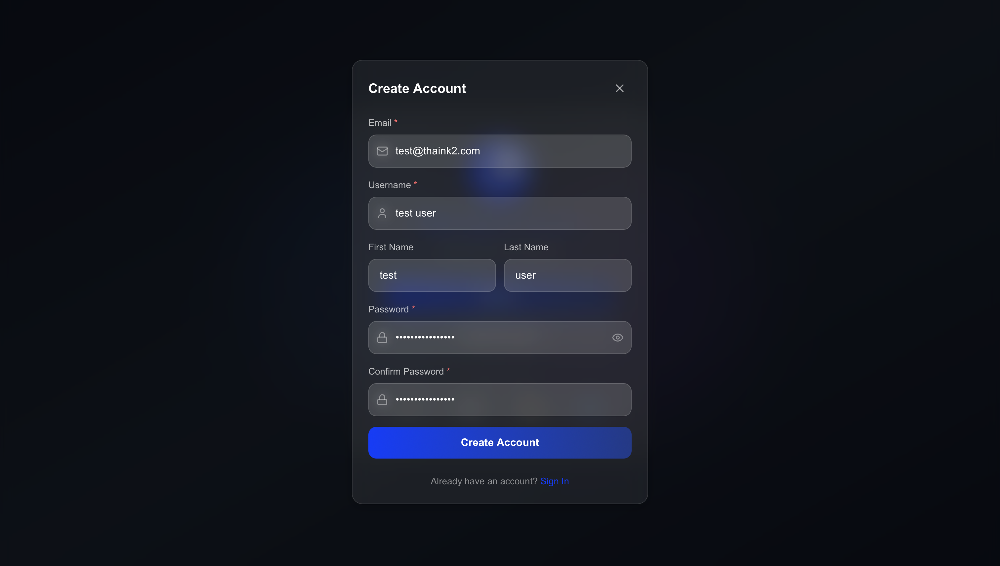
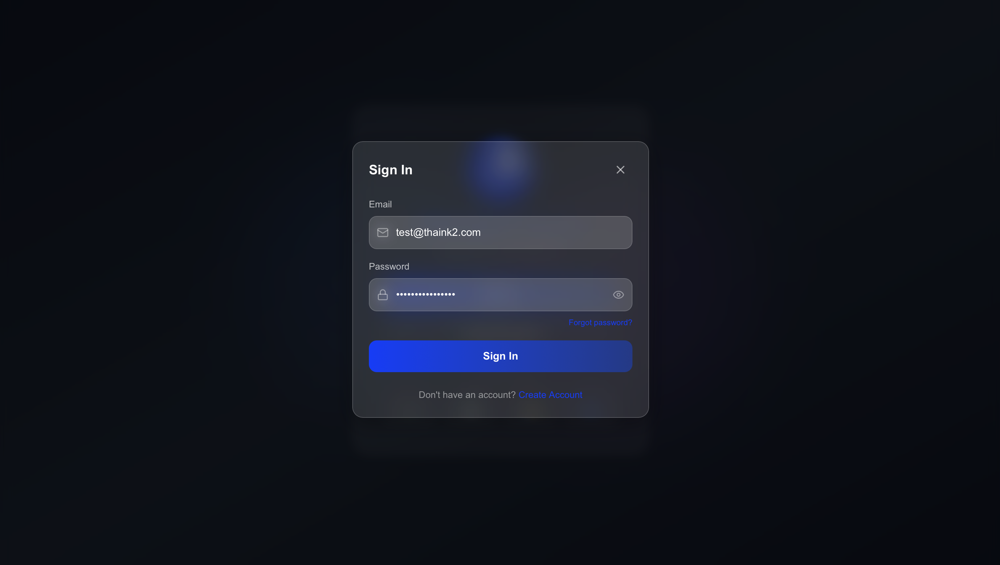

# thaink² Agentic Platform

**thaink²** is a full-stack AI agent platform that lets you create, configure, and run intelligent agents powered by Large Language Models (LLMs). It supports conversational agents, document-aware agents (RAG), database-querying agents (Text-to-SQL), scheduled automation, artifact generation, and more — all accessible through a clean REST API.

---

## Table of Contents

1. [Getting Started](#getting-started)
2. [Authentication](#authentication)
3. [Work With Agents](#work-with-agents)
4. [RAG as a Service](#rag-as-a-service)
5. [Text to SQL](#text-to-sql)
6. [Running Agents (Conversations)](#running-agents-conversations)
7. [Handling Artifacts](#handling-artifacts)
8. [API Quick Reference](#api-quick-reference)

---

## Getting Started

### Health Check

Before making any calls, verify the server is running:

```http
GET /health
```

**Response:**
```json
{
  "status": "healthy",
  "service": "th2agent"
}
```

---

## Authentication

All endpoints (except `/health` and `/api/auth/token`) require a **Bearer JWT token** in the `Authorization` header.

```
Authorization: Bearer <your_access_token>
```

### Step 1 — Create a User Account



```http
POST /api/users
Content-Type: application/json

{
  "email": "you@example.com",
  "password": "yourpassword"
}
```

### Step 2 — Log In and Get a Token



```http
POST /api/auth/token
Content-Type: application/x-www-form-urlencoded

username=you@example.com&password=yourpassword
```

**Response:**
```json
{
  "access_token": "eyJhbGciOiJIUzI1NiIsInR5cCI6IkpXVCJ9...",
  "token_type": "bearer"
}
```

Copy the `access_token` — you'll pass it as `Authorization: Bearer <token>` in every subsequent request.

### Refresh & Logout

| Method | Endpoint | Description |
|--------|----------|-------------|
| `POST` | `/api/auth/refresh-token` | Get a new access token using your refresh token cookie |
| `POST` | `/api/auth/logout` | Clear the refresh token cookie |

### Multi-Factor Authentication (MFA)

MFA is optional but supported via TOTP (e.g., Google Authenticator). Once enabled, every login will require a one-time code from your authenticator app.


| Method | Endpoint | Description |
|--------|----------|-------------|
| `POST` | `/api/auth/mfa/setup` | Generate a QR code to scan |
| `POST` | `/api/auth/mfa/enable` | Activate MFA with a TOTP code |
| `POST` | `/api/auth/mfa/verify` | Complete login with MFA code |
| `POST` | `/api/auth/mfa/disable` | Turn off MFA |
| `GET` | `/api/auth/mfa/status` | Check if MFA is enabled |
| `GET` | `/api/auth/mfa/backup-codes` | Retrieve backup codes |

---

## Work With Agents

An **agent** is an AI assistant you configure with a model, instructions, and a set of tools. Once created, you can have conversations with it, give it documents to read, connect it to databases, and automate it on a schedule.

### Creating an Agent


```http
POST /api/agents
Authorization: Bearer <token>
Content-Type: application/json

{
  "agent_name": "My Assistant",
  "agent_model": "gpt-4o",
  "agent_description": "A helpful assistant for data analysis",
  "agent_instruction": "You are a data analyst. Answer questions clearly and provide insights based on the data you are given.",
  "agent_type": "llm",
  "agent_tools": [],
  "memory_enabled": false,
  "artifacts_enabled": false,
  "tags": ["analytics", "data"]
}
```

**Key fields explained:**

| Field | Required | Description |
|-------|----------|-------------|
| `agent_name` | ✅ | Human-readable name for the agent |
| `agent_model` | ✅ | The LLM to use (e.g. `gpt-4o`, `claude-3-5-sonnet`) |
| `agent_description` | ✅ | Short summary of what this agent does |
| `agent_instruction` | ✅ | The system prompt — how the agent should behave |
| `agent_type` | ✅ | Use `"llm"` for a standard agent |
| `agent_tools` | ❌ | List of tool IDs to enable |
| `sub_agents` | ❌ | IDs of sub-agents (for multi-agent pipelines) |
| `memory_enabled` | ❌ | Set `true` to enable persistent memory across sessions |
| `artifacts_enabled` | ❌ | Set `true` to allow the agent to generate file artifacts |
| `input_schema` / `output_schema` | ❌ | JSON schemas for structured I/O |
| `guardrails_config` | ❌ | Safety rules for the agent |

**Response:**
```json
{
  "agent_id": "agent42",
  "agent_name": "My Assistant",
  "status": "created"
}
```

> 💡 Save the `agent_id` — you'll use it in all subsequent calls.

### List Your Agents

```http
GET /api/agents
Authorization: Bearer <token>
```

### Get a Specific Agent

```http
GET /api/agents/{agent_id}
Authorization: Bearer <token>
```

### Update an Agent

```http
PUT /api/agents/{agent_id}
Authorization: Bearer <token>
Content-Type: application/json

{ ...same fields as create... }
```

### Delete an Agent

```http
DELETE /api/agents/{agent_id}
Authorization: Bearer <token>
```

### Creating Tools

Tools extend what your agent can do — connect to databases, send emails, call external APIs, and more. Attach them to any agent via `agent_tools`.


---

## RAG as a Service

**RAG** (Retrieval-Augmented Generation) lets your agent answer questions based on documents you provide — PDFs, web pages, database exports, or S3 files. Upload your documents, and the agent will automatically search them when answering questions.

### How it works

```
Upload documents → Documents get indexed → Agent uses them when answering
```

### Agent Setup


### Live Demo


---

### Step 1 — Create a Config (if using a database or S3 source)

For file and URL uploads you can skip this step. For database or S3 sources, first save your connection details:

```http
POST /api/config/create
Authorization: Bearer <token>
Content-Type: application/json

{
  "tool_name": "text_to_sql",
  "tool_config_name": "My Postgres DB",
  "tool_config_params": {
    "DB_HOST": "db.example.com",
    "DB_PORT": "5432",
    "DB_NAME": "mydb",
    "DB_USER": "readonly_user",
    "DB_PASSWORD": "secret",
    "DB_SCHEMA": "public"
  },
  "tool_category": "database"
}
```

This returns a `tool_config_id` you'll use in later calls.

---

### Step 2 — Index Your Documents

#### Option A: Upload Files (PDF, CSV, TXT, etc.)

```http
POST /api/rag/index-files
Authorization: Bearer <token>
Content-Type: multipart/form-data

agent_id=agent42
files=<your file(s)>
session_id=session_001   (optional — scopes documents to a specific conversation)
```

- Maximum file size: **50 MB per file**
- Multiple files can be uploaded at once

#### Option B: Index a URL

```http
POST /api/rag/index-url
Authorization: Bearer <token>
Content-Type: application/json

{
  "agent_id": "agent42",
  "url": "https://example.com/report.pdf",
  "name": "Q4 Report",
  "session_id": "session_001"
}
```

#### Option C: Index from a Database (SQL query)

```http
POST /api/rag/index-db
Authorization: Bearer <token>
Content-Type: application/json

{
  "agent_id": "agent42",
  "tool_config_id": "config_123",
  "sql_query": "SELECT * FROM sales WHERE year = 2024",
  "name": "Sales 2024",
  "session_id": "session_001"
}
```

#### Option D: Index from a Database using Natural Language

No need to write SQL — just describe what you want:

```http
POST /api/rag/index-db-nl
Authorization: Bearer <token>
Content-Type: application/json

{
  "agent_id": "agent42",
  "nl_description": "Get all customer orders from last quarter grouped by region",
  "name": "Q3 Orders by Region",
  "tool_config_id": "config_123",
  "session_id": "session_001"
}
```

#### Option E: Index files from Amazon S3

```http
POST /api/rag/index-s3
Authorization: Bearer <token>
Content-Type: application/json

{
  "agent_id": "agent42",
  "tool_config_id": "config_s3",
  "s3_urls": ["s3://my-bucket/reports/q4.pdf"],
  "name": "Q4 S3 Report"
}
```

---

### Step 3 — Track Indexing Progress

Documents are processed asynchronously. You can track progress in two ways:

**Poll for a specific document's status:**

```http
GET /api/rag/status/{knowledge_id}
Authorization: Bearer <token>
```

**Stream real-time progress (Server-Sent Events):**

```http
GET /api/rag/stream/{agent_id}?session_id=session_001
Authorization: Bearer <token>
```

This opens a live stream that pushes events as each document finishes processing:

```
event: connected
data: {"sources": [...]}

event: status
data: {"knowledge_id": "k_abc", "status": "complete"}

event: complete
data: {"message": "All sources processed"}
```

---

### Step 4 — View Indexed Sources

```http
GET /api/rag/knowledge/{agent_id}?session_id=session_001
Authorization: Bearer <token>
```

---

### Step 5 — Talk to Your Agent

Once documents are indexed, simply run the agent (see [Running Agents](#running-agents-conversations)) — it will automatically search the indexed documents when answering.

---

## Text to SQL

The Text-to-SQL feature allows you to connect an agent to a relational database. Users can then ask questions in plain language and the agent will write and execute the SQL query automatically.

### Agent Setup


### Live Demo


---

### Step 1 — Create a Database Config

```http
POST /api/config/create
Authorization: Bearer <token>
Content-Type: application/json

{
  "tool_name": "text_to_sql",
  "tool_config_name": "Production Database",
  "tool_config_params": {
    "DB_HOST": "db.example.com",
    "DB_PORT": "5432",
    "DB_NAME": "production",
    "DB_USER": "analyst",
    "DB_PASSWORD": "secret",
    "DB_SCHEMA": "public"
  },
  "tool_category": "database"
}
```

### Step 2 — Create an Agent with Text-to-SQL Enabled

```http
POST /api/agents
Authorization: Bearer <token>
Content-Type: application/json

{
  "agent_name": "Database Assistant",
  "agent_model": "gpt-4o",
  "agent_description": "Answers questions about our sales database",
  "agent_instruction": "You are a database assistant. Use the text_to_sql tool to answer data questions.",
  "agent_type": "llm",
  "agent_tools": ["text_to_sql"],
  "superagent_template_id": "text_to_sql"
}
```

### Step 3 — Start a Conversation

```http
POST /api/adk/sessions
Authorization: Bearer <token>
Content-Type: application/json

{
  "agent_name": "Database Assistant",
  "user_id": "you@example.com",
  "session_id": "session_db_001",
  "data": {}
}
```

### Step 4 — Run the Agent

```http
POST /api/adk/run
Authorization: Bearer <token>
Content-Type: application/json

{
  "agent_name": "Database Assistant",
  "user_id": "you@example.com",
  "session_id": "session_db_001",
  "new_message": {
    "role": "user",
    "parts": [{ "text": "What were our top 5 selling products last month?" }]
  },
  "run_mode": "single",
  "streaming": false
}
```

The agent will introspect the schema, generate SQL, execute it, and return the answer in plain language.

---

## Running Agents (Conversations)

This section covers the full conversation lifecycle — from creating a session to running the agent.

### Create a Session

A **session** is a single conversation thread. Create one before sending messages.

```http
POST /api/adk/sessions
Authorization: Bearer <token>
Content-Type: application/json

{
  "agent_name": "My Assistant",
  "user_id": "you@example.com",
  "session_id": "session_001",
  "data": {}
}
```

> 💡 You can reuse `session_id` across multiple `/run` calls to maintain conversation history.

---

### Run the Agent (blocking response)

Sends a message and waits for the full response.

```http
POST /api/adk/run
Authorization: Bearer <token>
Content-Type: application/json

{
  "agent_name": "My Assistant",
  "user_id": "you@example.com",
  "session_id": "session_001",
  "new_message": {
    "role": "user",
    "parts": [{ "text": "Summarize the uploaded report" }]
  },
  "run_mode": "single",
  "streaming": false
}
```

**Response:**
```json
{
  "response": "The report covers...",
  "session_id": "session_001",
  "session_created": false
}
```

---

### Run the Agent (streaming response via SSE)

Returns the response token-by-token as a Server-Sent Events stream — ideal for chat UIs.

```http
POST /api/adk/run_sse
Authorization: Bearer <token>
Content-Type: application/json

{
  "agent_name": "My Assistant",
  "user_id": "you@example.com",
  "session_id": "session_001",
  "new_message": {
    "role": "user",
    "parts": [{ "text": "Explain the key findings" }]
  },
  "run_mode": "single",
  "streaming": true
}
```

The response is a stream of SSE events:

```
data: {"type": "text", "content": "The key findings"}
data: {"type": "text", "content": " are as follows..."}
data: {"type": "done"}
```

---

### Get Conversation History

```http
GET /api/adk/sessions/{agent_name}/{user_id}/{session_id}
Authorization: Bearer <token>
```

**Response:**
```json
{
  "messages": [
    { "role": "user", "content": "Summarize the report", "timestamp": 1710000000 },
    { "role": "assistant", "content": "The report covers...", "timestamp": 1710000005 }
  ]
}
```

### Get Session Trace (for debugging)

Returns a structured trace of all agent steps, tool calls, and decisions:

```http
GET /api/adk/sessions/{agent_name}/{user_id}/{session_id}/trace
Authorization: Bearer <token>
```

### List All Sessions

```http
GET /api/adk/sessions/list
Authorization: Bearer <token>
```

### Delete a Session

```http
DELETE /api/adk/sessions/{agent_name}/{user_id}/{session_id}
Authorization: Bearer <token>
```

---

### Schedule an Agent Run

Automate your agent to run on a recurring schedule:

```http
POST /api/adk/schedule_run
Authorization: Bearer <token>
Content-Type: application/json

{
  "agent_id": "agent42",
  "user_id": "you@example.com",
  "session_id": "session_scheduled",
  "new_message": {
    "role": "user",
    "parts": [{ "text": "Generate the daily report" }]
  },
  "schedule_interval": "@daily",
  "start_time": "2026-03-10T08:00:00"
}
```

Supported `schedule_interval` values: `@hourly`, `@daily`, `@weekly`, `@monthly`, or a custom cron expression like `"0 9 * * 1"`.

---

## Handling Artifacts

Artifacts are files the agent generates during a run — Python scripts, SQL files, reports, or any other code it writes. They are stored server-side and can be listed, read, and even **executed** directly through the API.

> 💡 To enable artifact generation for an agent, set `"artifacts_enabled": true` when creating or updating the agent.

All artifact endpoints follow the same path structure: `{agent_name}/{user_id}/{session_id}` to scope files to the right conversation.

### List Artifacts for a Session

```http
GET /api/artifacts/{agent_name}/{user_id}/{session_id}
Authorization: Bearer <token>
```

**Response:**
```json
[
  { "filename": "analysis.py", "language": "python", "version": 1, "source": "adk" },
  { "filename": "report.sql", "language": "sql", "version": 1, "source": "adk" }
]
```

### Get an Artifact's Content

```http
GET /api/artifacts/{agent_name}/{user_id}/{session_id}/{filename}
Authorization: Bearer <token>
```

**Response:**
```json
{
  "filename": "analysis.py",
  "language": "python",
  "code": "import pandas as pd\n...",
  "version": 1,
  "source": "adk"
}
```

**Example — agent writes a Python script, you run it:**
```
You → agent: "Write a script that calculates compound interest"
Agent → generates: compound_interest.py

GET  /api/artifacts/.../compound_interest.py         → read the code
POST /api/artifacts/.../compound_interest.py/execute → run it
     → returns: { "stdout": "After 10 years: $16,288.95", "exit_code": 0 }
```

---

## API Quick Reference

### Authentication

| Method | Endpoint | Auth Required | Description |
|--------|----------|:---:|-------------|
| `POST` | `/api/users` | ❌ | Create a new user account |
| `POST` | `/api/auth/token` | ❌ | Log in and get an access token |
| `POST` | `/api/auth/refresh-token` | ❌ | Refresh the access token |
| `POST` | `/api/auth/logout` | ✅ | Log out (clear refresh token) |

### Agents

| Method | Endpoint | Description |
|--------|----------|-------------|
| `GET` | `/api/agents` | List all agents |
| `POST` | `/api/agents` | Create an agent |
| `GET` | `/api/agents/{id}` | Get an agent |
| `PUT` | `/api/agents/{id}` | Update an agent |
| `DELETE` | `/api/agents/{id}` | Delete an agent |

### Conversations (ADK Runner)

| Method | Endpoint | Description |
|--------|----------|-------------|
| `POST` | `/api/adk/sessions` | Create a new conversation session |
| `GET` | `/api/adk/sessions/list` | List all sessions |
| `GET` | `/api/adk/sessions/{agent}/{user}/{session}` | Get conversation history |
| `GET` | `/api/adk/sessions/{agent}/{user}/{session}/trace` | Get agent execution trace |
| `PATCH` | `/api/adk/sessions/{agent}/{user}/{session}` | Update session state |
| `DELETE` | `/api/adk/sessions/{agent}/{user}/{session}` | Delete a session |
| `POST` | `/api/adk/run` | Run agent (blocking) |
| `POST` | `/api/adk/run_sse` | Run agent (streaming SSE) |
| `POST` | `/api/adk/schedule_run` | Schedule a recurring run |
| `POST` | `/api/adk/run_now` | Trigger an immediate run |

### RAG

| Method | Endpoint | Description |
|--------|----------|-------------|
| `POST` | `/api/rag/index-files` | Upload and index files |
| `POST` | `/api/rag/index-url` | Index a web URL |
| `POST` | `/api/rag/index-db` | Index database results (SQL) |
| `POST` | `/api/rag/index-db-nl` | Index database results (natural language) |
| `POST` | `/api/rag/index-s3` | Index files from S3 |
| `GET` | `/api/rag/status/{knowledge_id}` | Check indexing status |
| `GET` | `/api/rag/knowledge/{agent_id}` | List all sources for an agent |
| `GET` | `/api/rag/stream/{agent_id}` | Stream indexing progress (SSE) |

### Artifacts

| Method | Endpoint | Description |
|--------|----------|-------------|
| `GET` | `/api/artifacts/{agent}/{user}/{session}` | List artifacts for a session |
| `GET` | `/api/artifacts/{agent}/{user}/{session}/{filename}` | Get artifact content |
| `POST` | `/api/artifacts/{agent}/{user}/{session}/{filename}/execute` | Execute an artifact |

---

## Error Codes

| Code | Meaning |
|------|---------|
| `400` | Bad request — check your request body |
| `401` | Unauthorized — missing or invalid token |
| `403` | Forbidden — you don't own this resource |
| `404` | Not found — agent, session, or document doesn't exist |
| `413` | File too large — max 50 MB per file |
| `422` | Unprocessable — e.g., query returned no data |
| `500` | Internal server error |
| `503` | Service temporarily unavailable |

---